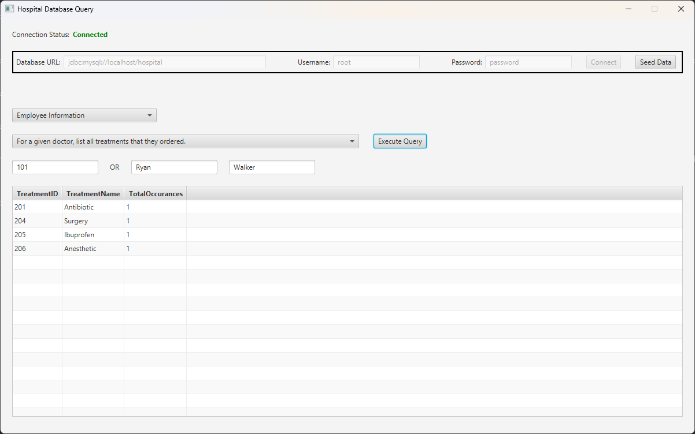

# Hospital Database Query

### Hospital Database Query is a simple tool to connect to our hospital database and perform predefined queries.

## How to Use

This project is intended to be run from IntelliJ Idea.

Connection to a MySQL database is also required.

### Connect to the database

Enter the database connection information at the top, and click the **Connect** button. If successful, the Connection Status will show *Connected*, otherwise an error will be indicated.

### Seeding data (Optional)

After connecting to a new, empty database, click the **Seed Data** button to create tables and insert data as defined in Checkpoint 2. This is optional and simply a quick and easy way to load our data into a new database.

### Select a query type
In the *Select a query type...* dropdown menu, select the type of query that you would like to perform. This filters queries to only show you queries of that type.

### Select a query
In the *Select a query...* dropdown menu, select the query that you would like to perform.

### Enter query selection data (Optional)
For some queries, additional selection values such as a date range, name, or ID will be required. Enter that information in their respective fields. If no additional fields are shown, no additional information is required.

### Execute query

Once a query has been selected and any additional query selection values have been filled in, click the **Execute Query** button to perform the query. Results will be shown in the table below.
